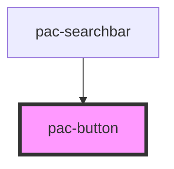

# pac-button

<!-- Auto Generated Below -->

## Properties

| Property  | Attribute | Description | Type                                                                                                                                                                                                  | Default    |
| --------- | --------- | ----------- | ----------------------------------------------------------------------------------------------------------------------------------------------------------------------------------------------------- | ---------- |
| `color`   | `color`   |             | `"blue" \| "cyan" \| "emerald" \| "fuchsia" \| "gray" \| "green" \| "indigo" \| "neutral" \| "orange" \| "pink" \| "purple" \| "red" \| "rose" \| "sky" \| "slate" \| "teal" \| "violet" \| "yellow"` | `"blue"`   |
| `enabled` | --        |             | `Boolean`                                                                                                                                                                                             | `true`     |
| `look`    | `look`    |             | `"glass" \| "solid"`                                                                                                                                                                                  | `"solid"`  |
| `size`    | `size`    |             | `"large" \| "normal" \| "small"`                                                                                                                                                                      | `"normal"` |

## Dependencies

### Used by

 - [pac-searchbar](../pac-searchbar)

### Graph

----------------------------------------------

*Built with [StencilJS](https://stenciljs.com/)*
