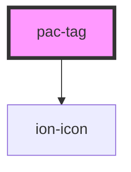

# pac-tag

<!-- Auto Generated Below -->

## Properties

| Property    | Attribute   | Description | Type                                                                                                                                                                                                  | Default  |
| ----------- | ----------- | ----------- | ----------------------------------------------------------------------------------------------------------------------------------------------------------------------------------------------------- | -------- |
| `color`     | `color`     |             | `"blue" \| "cyan" \| "emerald" \| "fuchsia" \| "gray" \| "green" \| "indigo" \| "neutral" \| "orange" \| "pink" \| "purple" \| "red" \| "rose" \| "sky" \| "slate" \| "teal" \| "violet" \| "yellow"` | `"blue"` |
| `deletable` | `deletable` |             | `boolean`                                                                                                                                                                                             | `false`  |

## Events

| Event       | Description | Type                |
| ----------- | ----------- | ------------------- |
| `pacRemove` |             | `CustomEvent<void>` |

## Dependencies

### Depends on

- ion-icon

### Graph

----------------------------------------------

*Built with [StencilJS](https://stenciljs.com/)*
